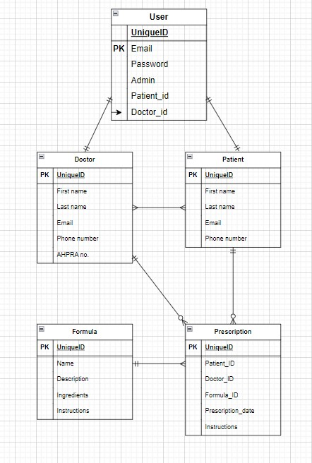
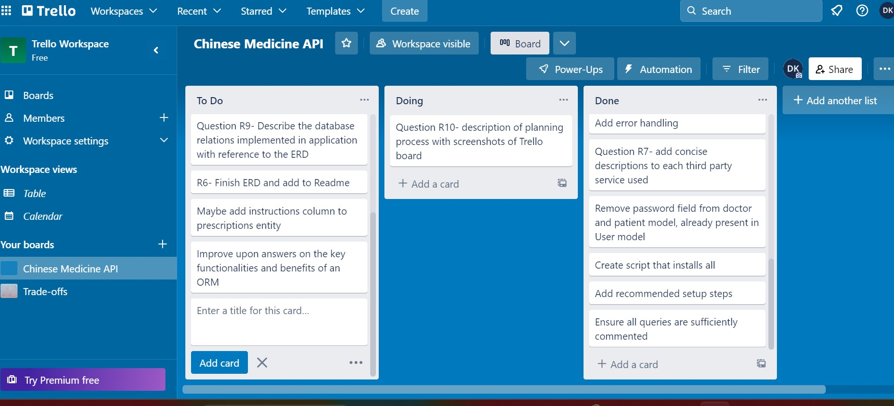

# **Chinese Medicine API** <br>  is a RESTful API for Chinese Medicine practitioners. <br>
Practitioners can use this API to store their patients' Herbal Formula prescriptions. <br> Patients can also use the API to access their own formula history. 
<br><br>
## What problem is this app trying to solve? 
There are a number of web-based practice management apps already available on the web. Such software(s) usually provide a whole gamut of features, including treatment recording and booking systems. They contain many features that aren't relevant or useful to a herbal medicine specialist, and it is often costly to pay for ongoing prescriptions. 

The aim of this app is to provide a solution that is niched towards simple recording of patient data and prescriptions, with a specialised focus on Chinese Medicine herbal formulas. It is a simple and affordable solution for Chinese medicine herbalists. 

## Why this problem needs solving
Chinese medicine practitioners are often sole practitioners, and do not have the resources to invest in expensive software. They are often looking for a simple and affordable solution to record their patient data and prescriptions.

## Why is PostgreSQL the database of choice? And what are the drawbacks compared to others?

PostgreSQL is a powerful, open-source relational database management system. It is a great choice for this project because it is free and open-source, and it is also a very powerful database. It is also a great choice because it is a relational database, which is a great fit for this project. Additionally, it is a very scalable database, which is important for a project that is expected to grow in the future.

(“Advantages of PostgreSQL - CYBERTEC | Data Science & PostgreSQL,” n.d.; PostgreSQL Advantages, n.d.)

In comparison to other databases, some known drawbacks of PostgreSQL include: 

- Slower speeds: while usually not a huge issue, PostgreSQL can be a little slower than other database systems, especially for complex queries and large datasets.

- Less support for non-relational data: PostgreSQL is a relational database, and is not as good at handling non-relational data as other databases.

(What Is PostgreSQL? Introduction, Advantages & Disadvantages, n.d.)

## What are the key benefits of an ORM? 

Using an ORM (Object-Relational Mapping) in software development can provide various benefits:

- Decreased development time and complexity: ORMs simplify the process of communicating with databases, reducing the amount of code needed. This allows developers to build complex applications faster with less code, giving them more time to focus on other areas of the application.

- Improved maintainability: ORMs standardize the way applications interact with databases, making it easier to update and modify code without requiring extensive modifications to SQL queries or other database-related code.

- Increased portability: ORMs abstract away the differences between various database systems, improving the ability of applications to be developed on one system and then deployed on another without extensive code changes.

- Enhanced security: ORMs can help prevent SQL injection attacks by handling formatting and validation of SQL queries automatically, making it more difficult for attackers to exploit vulnerabilities in the application.

- Improved performance: ORMs can use caching and other optimization techniques to reduce the number of database queries needed, leading to significant performance improvements for applications that work with large amounts of data.

- Simplified testing: ORMs provide a simplified interface for working with databases, making it easier to write unit tests for database-related code. This makes it easier to identify and fix bugs, ultimately improving the overall quality of the application.

(Hoyos, 2019; SQLAlchemy ORM — SQLAlchemy 1.4 Documentation, n.d.; What Is an ORM – The Meaning of Object Relational Mapping Database Tools, 2022)

<br>

## What are the key functionalities of an ORM? 

The main functionalities of an ORM are:

- Object-Relational Mapping: Developers can map database tables to objects in their code, which provides an intuitive and familiar way of working with data. This simplifies coding, reduces errors, and enhances readability.

- Automatic SQL query generation: ORMs generate SQL queries automatically based on developer requests, so developers don't have to write complex SQL queries themselves. This saves time and reduces the likelihood of errors.

- Caching: ORMs can store frequently accessed data in memory, which boosts application performance by allowing quick and efficient data retrieval without repetitive database queries.

- Data validation and conversion: ORMs automatically validate data against predefined rules and constraints to ensure consistency and accuracy. Additionally, ORMs can convert data between different types, making it easier to work with data in various formats.

- Relationship management: ORMs can manage relationships between objects, simplifying the process of working with complex data structures and reducing the likelihood of errors. Developers can create and manage relationships between different objects in their code with ease.

(Hoyos, 2019; SQLAlchemy ORM — SQLAlchemy 1.4 Documentation, n.d.; What Is an ORM – The Meaning of Object Relational Mapping Database Tools, 2022)

<br>

## API endpoints
<br>

### **Authentication**

**/signup** POST <br>
This creates a new user for navigating the API. An admin account must be created first, for which the admin field should be set to true, and the patient_id and doctor_id fields should be set to null. <br>


```json
{
	"email": "admin@gmail.com",
	"password": "password", 
	"admin": true,
	"patient_id": null,
	"doctor_id": null
    }
```
Once doctors and patients have been created in their respective entities (see doctor and patient endpoints below), the admin can create new user accounts for the doctors and patients. The admin field should be set to false, and the patient_id and doctor_id fields should be set to the id of the patient or doctor that the user is associated with. <br>

Whenever a new user is created, the user will be assigned a JWT token. 

```json
{
	"email": "doctor1@gmail.com",
	"password": "password", 
	"admin": false,
	"patient_id": null,
	"doctor_id": 1
    }
```

**/login** POST <br>
Existing users can login to the API using this endpoint, after which the user will be assigned a new JWT token.<br>

```json
{
    "email": "patient1@gmail.com",
    "password": "password"
}
```
**/users** GET <br>
This endpoint allows all users to be retrieved, must be logged in as admin. <br>

**/users/<id>** DELETE <br>
This endpoint allows a specific user to be deleted by id, must be logged in as admin. <br>


### **Doctors**

**/doctors** POST <br>
This endpoint allows new doctors to be created, must be logged in as admin. A doctor id will be automatically generated. <br>

```json
    {
	"first_name": "Darren",
	"last_name": "Marksel",
	"email": "darrenmarksel@doctor.com",
	"phone_number": "0486680354",
	"AHPRA_number": "LIEN9456484"
}
```

**/doctors** GET <br>
This endpoint allows all doctors to be retrieved, must be logged in as admin. <br>

**/doctors/{doctor_id}** GET <br>
This endpoint allows a specific doctor to be retrieved by doctor_id, must be logged in as admin. <br>

**/doctors/{doctor_id}** PUT <br>
This endpoint allows a specific doctor to be updated by doctor_id, must be logged in as admin. <br>

```json
    {
    "first_name": "Darren",
    "last_name": "Marksel",
    "email": "darrenmarksel@doctor.com",
    "phone_number": "0486681111",
    "AHPRA_number": "LIEN9456484"
}
```

**/doctors/{doctor_id}** DELETE <br>
This endpoint allows a specific doctor to be deleted by doctor_id, must be logged in as admin. <br>     

### **Patients**

**/patients** POST <br>
This endpoint allows new patients to be created, must be logged in as a doctor or admin. A patient id will be automatically generated. <br>

```json
    {
    "first_name": "John",
    "last_name": "Smith",
    "email": "johnsmith@patient.com",
    "phone_number": "0486680354"
}
```

**/patients** GET <br>
This endpoint allows all patients to be retrieved, must be logged in as admin. <br>

**/patients/{patient_id}** GET <br>
This endpoint allows a specific patient to be retrieved by patient_id, must be logged in as admin. <br>

**/patients/{patient_id}** PUT <br>
This endpoint allows a specific patient to be updated by patient_id, must be logged in as admin. <br>

```json
    {
    "first_name": "Jonathon",
    "last_name": "Smith",
    "email": "johnsmith@patient.com",
    "phone_number": "0486681111"
}
```

**/patients/{patient_id}** DELETE <br>
This endpoint allows a specific patient to be deleted by patient_id, must be logged in as admin. <br>

### **Formulas**

**/formulas** POST <br>
This endpoint allows new formulas to be created, must be logged in as a doctor or admin. A formula id will be automatically generated. <br>

***Example 1***
```json
    {
    "name": "Si Ni San",
    "description": "Si Ni San is a traditional Chinese herbal formula used to treat a variety of conditions, including anxiety, depression, insomnia, and menopausal symptoms.",
    "ingredients": "Bai shao, chai hu, zhi shi, zhi gan cao",
    "instructions": "Take 1 tsp of powder in hot water, twice a day"
}
```
***Example 2***
```json
    {
    "name": "Li Zhong Wan",
    "description": "Li zhong wan is a traditional Chinese herbal formula commonly used to treat digestive issues, including indigestion, bloating, and diarrhea.",
    "ingredients": "Bai zhu, Gan jiang, Ren shen, Zhi gan cao",
    "instructions": "Take 3 pills, 3 times a day"
}
```

**/formulas** GET <br>
This endpoint allows all formulas to be retrieved, must be logged in as admin or doctor. <br>

**/formulas/{formula_id}** GET <br>
This endpoint allows a specific formula to be retrieved by formula_id, must be logged in as admin or doctor. <br>

**/formulas/{formula_id}** PUT <br>
This endpoint allows a specific formula to be updated by formula_id, must be logged in as admin or doctor. <br>

```json
    {
    "name": "Li Zhong Wan",
    "description": "Li zhong wan is a traditional Chinese herbal formula commonly used to treat digestive issues, including indigestion, bloating, and diarrhea.",
    "ingredients": "Bai zhu 9, Gan jiang 9, Ren shen 9, Zhi gan cao 9",
    "instructions": "Take 6 pills, twice a day"
}
```

**/formulas/{formula_id}** DELETE <br>
This endpoint allows a specific formula to be deleted by formula_id, must be logged in as admin. <br>

### **Prescriptions**

**/prescriptions** POST <br>
This endpoint allows new prescriptions to be created, must be logged in as a doctor or admin. A prescription id will be automatically generated. <br>

```json
    {
    "formula_id": 1,
    "patient_id": 1,
    "doctor_id": 1,
    "instructions": "Take 1 tsp of powder in hot water, twice a day",
}
```

**/prescriptions** GET <br>
This endpoint allows all prescriptions to be retrieved, must be logged in as admin. <br>

**/prescriptions/{prescription_id}** GET <br>
This endpoint allows a specific prescription to be retrieved by prescription_id, must be logged in as admin, or the original prescribing doctor. <br>

**/prescriptions/{patient_id}** GET <br>
This endpoint allows all prescriptions for a specific patient to be retrieved by patient_id, must be logged in as admin, or doctor. <br>

**/prescriptions/{doctor_id}** GET <br>
This endpoint allows all prescriptions for a specific doctor to be retrieved by doctor_id, must be logged in as admin, or doctor. <br>

**/prescriptions/patient/email/{email}** GET <br>
This endpoint allows all prescriptions for a specific patient to be retrieved by patient email, must be logged in as the patient with the relevant email. This is the main endpoint for patients to view their prescriptions. <br>

**/prescriptions/{prescription_id}** PUT <br>
This endpoint allows a specific prescription to be updated by prescription_id, must be logged in as admin. <br>

```json
    {
    "formula_id": 2,
    "patient_id": 1,
    "doctor_id": 1,
    "instructions": "Take 3 pills, twice a day"
}
```

**/prescriptions/{prescription_id}** DELETE <br>
This endpoint allows a specific prescription to be deleted by prescription_id, must be logged in as admin. <br>


<br>

## Recommended Setup
1. It is assumed that you have PostgreSQl installed on your machine. If you do not, you can download it here: https://www.postgresql.org/download/
2. Run script.sh. This will create and initialise a virtual environment, install all dependencies, and create the tables in the database.
3. Run the API with the command: `flask run`
4. You can now use the API endpoints below to interact with the database.
5. Create an admin user account using the /signup POST endpoint. The admin field should be set to true, and the patient_id and doctor_id fields should be set to null.
```json
{
	"email": "admin@gmail.com",
	"password": "password", 
	"admin": true,
	"patient_id": null,
	"doctor_id": null
    }
```
6. Create 3 doctor accounts using the /doctors POST endpoint.
```json
    {
	"first_name": "Darren",
	"last_name": "Marksel",
	"email": "darrenmarksel@doctor.com",
	"phone_number": "0486680354",
	"AHPRA_number": "LIEN9456484"
}
```

7. Create 3 patient accounts using the /patients POST endpoint.
```json
    {
    "first_name": "John",
    "last_name": "Smith",
    "email": "johnsmith@patient.com",
    "phone_number": "0486680354"
}
```
8. Create a user account for each doctor and patient using the /signup endpoint. The admin field should be set to false, and the patient_id and doctor_id fields should be set to the id of the patient or doctor that the user is associated with. The email and id field should be the same as the email and id fields in the doctor or patient entity.
```json
{
	"email": "johnsmith@patient.com",
	"password": "password", 
	"admin": false,
	"patient_id": 1,
	"doctor_id": null
    }

{
    "email": "darrenmarksel@doctor.com",
    "password": "password",
    "admin": false,
    "patient_id": null,
    "doctor_id": 1
}
```
9. Populate the formulas table using the /formulas endpoint. You can use the following examples, or create your own.

```json
    {
    "name": "Li Zhong Wan",
    "description": "Li zhong wan is a traditional Chinese herbal formula commonly used to treat digestive issues, including indigestion, bloating, and diarrhea.",
    "ingredients": "Bai zhu 9, Gan jiang 9, Ren shen 9, Zhi gan cao 9",
    "instructions": "Take 6 pills, twice a day"
}

{
    "name": "Sheng Mai San",
    "description": "Sheng mai san is a traditional Chinese herbal formula commonly used to treat fatigue, insomnia, and anxiety.",
    "ingredients": "Ren shen 9, Mai men dong 15, Wu wei zi 6",
    "instructions": "Take 1 tsp in hot water, twice daily"
}

{
    
    "name": "Si Ni San",
    "description": "Si Ni San is a traditional Chinese herbal formula used to treat a variety of conditions, including anxiety, depression, insomnia, and menopausal symptoms.",
    "ingredients": "Bai shao 9, chai hu 9, zhi shi 9, zhi gan cao 9",
    "instructions": "Take 1 tsp of powder in hot water, twice a day"

}
```

So by now, you should have the following in your database: <br>
- 1 admin user account
- 3 doctor account(s)
- 3 patient account(s)
- user accounts for all doctor(s)
- user accounts for all patient(s)
- 3 formula(s)

Now that these are populated, you can create new prescriptions using the /prescriptions endpoint.
```json
    {
    "formula_id": 1,
    "patient_id": 1,
    "doctor_id": 1,
    "instructions": "Take 1 tsp of powder in hot water, twice a day"
}
```

Please continue to read through the remaining endpoints and test them for yourself. 

<br>


## ERD 



<br>

## Third party services used


- ***Flask-SQLAlchemy 2.5.1*** <br>
A flask extension that provides integration between Flask and SQLAlchemy. With this extension one can easily define database models as Python classes, and interact with them using SQLAlchemy’s ORM. It allows one to create and manage database tables and relationships, and to define and run queries. (Flask-SQLAlchemy — Flask-SQLAlchemy Documentation (3.0.x), n.d.)<br>

- ***Flask-JWT-Extended 4.3.0*** <br>
A flask extension that provides JWT support for Flask. It allows one to easily add JWT authentication to their application with the use of decorators. (Flask-JWT-Extended — Flask-JWT-Extended Documentation (4.3.x), n.d.)<br>


- ***Marshmallow 3.13.0*** <br>
A Python library that provides a simple interface for serializing and deserializing complex data structures. It allows one to define schemas as Python classes, and interact with them using Marshmallow’s ORM. It allows one to create and manage schemas and relationships, and to define and run queries. (Marshmallow — Marshmallow Documentation (3.13.x), n.d.)<br>

- ***psycopg2 2.9.3*** <br>
A database driver that sends SQL statements to a SQL database. 

- ***pyjwt 2.6.0*** <br>
A Python library that provides a JSON Web Token implementation. It allows one to create and decode JSON Web Tokens. (PyJWT — PyJWT Documentation, n.d.)<br>

- ***SQLalchemy 1.4.39*** <br>
SQLalchemy is an ORM that generates SQL statements. (SQLAlchemy — SQLAlchemy Documentation (1.4.x), n.d.)<br>

- ***cryptography 2.8*** <br>
A Python library that provides cryptographic recipes and primitives to Python developers. It allows one to encrypt and decrypt data. (cryptography — cryptography Documentation (2.8.x), n.d.)<br>

- ***Insomnia 2022.7.5*** <br>
A REST client that allows one to test API endpoints. (Insomnia — Insomnia Documentation, n.d.)<br>

## Describe project models and database relationships

The following is a list of the models that I created for this project, and the relationships between them. <br>

- ***User*** <br>
The User model is used to store user account information. It has the following fields: <br>
- id
- email (primary key)
- password
- admin
- patient_id
- doctor_id

The User model has a one-to-one relationship with the Patient and Doctor models. This is because a user account can only be associated with one patient or doctor. <br>

- ***Patient*** <br>
The Patient model is used to store patient information. It has the following fields: <br>
- id (primary key)
- first_name
- last_name
- email
- phone_number

The Patient model has a one-to-many relationship with the Prescription model. This is because a patient can have many prescriptions. <br>

It has a many-to-many relationship with the Doctor model. This is because a patient can have many doctors, and a doctor can have many patients. <br>

- ***Doctor*** <br>

The Doctor model is used to store doctor information. It has the following fields: <br>
- id (primary key)
- first_name
- last_name
- email
- phone_number 
- AHPRA_number

The Doctor model has a one-to-many relationship with the Prescription model. This is because a doctor can have many prescriptions. <br>

It has a many-to-many relationship with the Patient model. This is because a doctor can have many patients, and a patient can have many doctors. <br>

- ***Formula*** <br>

The Formula model is used to store formula information. It has the following fields: <br>
- id (primary key)
- name
- description
- ingredients
- instructions

The Formula model has a one-to-many relationship with the Prescription model. This is because a formula can have many prescriptions. <br>

- ***Prescription*** <br>

The Prescription model is used to store prescription information. It has the following fields: <br>
- id (primary key)
- formula_id (foreign key)
- patient_id (foreign key)
- doctor_id (foreign key)
- instructions

The prescription table links the formula, patient, and doctor tables together. This kind of table is known as a junction table. (SQLAlchemy — SQLAlchemy Documentation (1.4.x), n.d.)<br> 


## Describe database relations with reference to the ERD

The following is a list of the database relationships that I created for this project, and the relationships between them. <br>

- ***User*** <br>
The User model has a one-to-one relationship with the Patient and Doctor models. This is because a user account can only be associated with one patient or doctor. <br>

- ***Patient*** <br>
The Patient model has a one-to-many relationship with the Prescription model. This is because a patient can have many prescriptions. <br>

It has a many-to-many relationship with the Doctor model. This is because a patient can have many doctors, and a doctor can have many patients. <br>


## Project Planning Process

For this project, I used somewhat of an Agile methodology, with very simple iterations. I started by creating a Trello board, and adding the following columns: <br>
- To Do
- Doing
- Done

All of the tasks that I needed to complete were added to the To Do column. I then started working on the tasks, and moved them to the Doing column. Once I had completed a task, I moved it to the Done column. As new tasks were added, I would move them to the To Do column. I repeated this process until all of the tasks were completed. 

<br>



